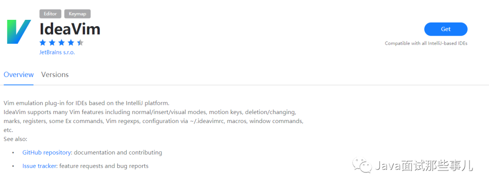

## 说实话，Intellij IDEA自带的Vim插件真心不错...

[编程最前线](javascript:void(0);) *Today*


点击蓝字之后，我们就是好朋友啦


来源：http://hsujee.com


对 Vim 十分熟悉的同学，掌握这个插件会很容易的，在他们的手中才会发挥出该款神器应有的价值。




当然基本的hjkl移动光标和几种常见模式等等基本概念就略过不提了。为了确保只包含常用操作，这里提到的技巧都没有从现成文档里抄，而是凭记忆列出。


**1、切换Vim模拟器状态**


这个插件允许设置一个快捷键一键开启或关闭，在切换模式时会同时自动切换keymap，十分方便。默认键位是Ctrl+Alt+V，但这个键位覆盖了很常用的“抽取局部变量”功能，建议重设，在setting->keymap中查找VIM Emulator即可。


由于开启和关闭状态分别使用两套keymap，因此两套都需要设定。可以把两套keymap下的都设为一样的键，也就是用同一个键切换。但个人建议设为不同的键，这样能清楚知道当前处于那种模式中。并且，如果在开启Vim的插入模式下关闭Vim模拟器，下次进入时仍然是插入模式，比较混乱（因为你关闭模拟器就是为了使用默认keymap输入大段代码，重新开启Vim模拟器就是为了使用普通模式下的命令）。


因此建议把Vim keymap中的Exit Insert Mode设为与另一个keymap的Vim Emulator相同的键（也就是进入Vim模拟器的快捷键）。


例如，我使用的设定是：


Default keymap -> Vim Emulator : Ctrl+;   (用Ctrl+分号开启Vim模拟器）

Vim keymap -> Vim Emulator : Ctrl+,  (用Ctrl+逗号关闭Vim模拟器）

Vim keymap -> Vim Emulator : Ctrl+;  (用Ctrl+分号退出插入模式，进入普通模式）


这样，在任何时候只要连按两下ctrl+分号，就能保证必定在Vim模拟器的普通模式中。


**2、ScrollOff 参数**


启动Intellij后在Vim模拟器下输入命令 :

- 

```
set so=5
```

可以令屏幕滚动时在光标上下方保留5行预览代码（也就是光标会在第5行触发向上滚动，或者在倒数第5行触发向下滚动）。


在代码窗口比较狭小时（例如单步跟踪调试时）非常方便。可惜仅在Vim模拟器开启时有效。


**3、行号定位**


普通模式下输入 行号G 或 :行号<回车> 都能快速定位到某一行。


区别在于前者在输入行号时屏幕上没有任何提示，后者则在Vim命令输入框中可以看到输入过程。


题外话：Sublime Text 2也是用 :行号 来快速定位到某行，应该是沿用了Vim的习惯。


**4、进入修改**


进入插入模式的方式有很多，直接选用合适的方式进入插入模式比进入后再用箭头键移动光标要好。常用的有：


o - 在当前行下方插入新行并自动缩进

O - 在当前行上方插入新行并自动缩进 （普通模式下的大写字母命令用 shift+字母键 输入，下同）

i - 在当前字符左方开始插入字符

a - 在当前字符右方开始插入字符

I - 光标移动到行首并进入插入模式

A - 光标移动到行尾并进入插入模式

s - 删除光标所在字符并进入插入模式

S - 删除光标所在行并进入插入模式

c<范围> - 删除光标所在位置周围某个范围的文本并进入插入模式。关于范围请看第5点，常用的组合有：caw - 删除一个单词包括它后面的空格并开始插入；ciw - 删除一个单词并开始插入；ci" - 删除一个字符串内部文本并开始插入；c$ - 从光标位置删除到行尾并开始插入；ct字符 - 从光标位置删除本行某个字符之前（保留该字符）并开始插入。等等。

C - 删除光标位置到行尾的内容并进入插入模式 (相当于c$)

r - 修改光标所在字符，然后返回普通模式

R - 进入覆盖模式


**5、范围操作**


某些普通模式的动作命令后面可以追加一些表示范围的指令，表示该动作将作用在整个范围上。这类命令常用的有：


d<范围> - 删除一定范围内的文本

c<范围> - 删除一定范围内的文本并进入插入模式

y<范围> - 将范围内的文本放入0号和"号注册栏

v<范围> - 选择范围内的文本

=<范围> - 自动缩进范围内的文本

gU<范围> - 将范围内的字符转换为大写

gu<范围> - 将范围内的字符转换为小写

\><范围> - 将范围中的内容缩进一格

<<范围> - 将范围中的内容取消缩进一格


常用的范围指令有：


空格 - 光标所在位置字符。（例如 gU空格 - 将光标位置字符转为大写）

重复某些动作命令 - 光标所在行。（例如dd删除一行，yy复制一行，cc删除一行文本并开始插入，>> 当前行缩进一格，==自动缩进当前行）

$ - 从光标位置到行尾

^ - 从光标位置到行首，不包含缩进空白

0 - 从光标位置到行首，包含缩进空白

gg - 从光标位置到文件开头

G - 从光标位置到文件结尾

% - 从光标位置到另一边匹配的括号

f<字符> - 从光标位置到光标右边某个字符首次出现的位置，包括该字符

F<字符> - 从光标位置到光标左边某个字符首次出现的位置，包括该字符

t<字符> - 从光标位置到光标右边某个字符首次出现的位置，包括该字符

F<字符> - 从光标位置到光标左边某个字符首次出现的位置，包括该字符

/正则表达式 - 从光标位置到下一个匹配正则表达式的位置（跨行）

?正则表达式 - 从光标位置到上一个匹配正则表达式的位置（跨行）

aw - 一个单词加一个空格 （a可理解为“一个”，下同）

iw - 一个单词 （i可理解为in，下同）

a" - 一个字符串包括双引号

i" - 一个字符串内部文本

a< - 一组< >包含的文本，包括< >号本身


同理类推：i<, a[, i[, a(, i( 


注意：真正vim中的it范围（一对xml标签内部）在ideaVim中不生效。

用/或?命令查找时，正则表达式默认大小写敏感，如果需要不敏感，可以在正则表达式开始处加上\c标志。


例如 /\cabc 可以匹配到 ABC。下面提到的:s命令同样适用。


**6、选择文本**


在Vim中，选择文本需要进入“可视模式”（Visual Mode），这个名称比较奇怪，它的来由据说是因为在Vim的前身Vi中，选择区域是不可见的。


在Vim中选择区域会高亮显示，因此称为“可视模式”。


v - 进入字符选择模式， V - 进入行选择模式， Ctrl+v - 进入块选择模式。

进入相应模式后移动光标即可选中文本。过程中可按o键令光标在选区两端切换。


在块选择模式中选中多行，然后按I或A后输入文本，再退出插入模式，所输入的文本将自动加入到每一行的开头或结尾。


**7、复制粘贴**


在Vim模式下，复制粘贴并不直接使用系统的剪贴板，而是使用Vim提供的多个“寄存器”，每个寄存器都以一个字符来表示。


关于寄存器的详细说明可以看这里 http://blah.blogsome.com/2006/04/27/vim_tut_register/ ，这里简单列一些常用的操作技巧


注意，vim使用双引号”来作为选择寄存器的命令，因此下文中的双引号均指在普通模式下按双引号键：


a）用y命令将文本存入寄存器后，如果想在别处替换原有内容，可以先用v命令选中原有内容，然后用p命令粘贴。


但第一次粘贴后，默认的寄存器”将被替换为刚刚删除的内容。如果要再次粘贴之前复制的内容，需要使用 “0p 命令组合来复制。


也可以进入插入模式后用 Ctrl+r 0 来复制，例如 ciw<Ctrl+r>0 命令组合将用粘贴内容替换光标处的一个单词，并停留在插入模式。


b）在Windows下，寄存器 + 和 * 都代表系统剪贴板，可以互换使用，选一个顺手的即可。


例如 “+yy 命令组合可将当前行复制到系统剪贴板。ci”<Ctrl+r>* 命令组合则将系统剪贴板的内容替换字符串的内部文本。


c) 寄存器1至9记录之前九次的删除大段文本，每次超过一行的删除操作都会导致这9个寄存器的内容发生位移，最近删除的文本会存入寄存器1。


但只有删除超过1行时才会影响寄存器1至9，行内的删除内容则会被存入寄存器-（减号）。


如果用q命令录制宏时不涉及跨行删除，可以在宏中直接使用这9个寄存器来暂存文本。


（在Vim中，复制内容与录制宏共享同一套寄存器，因此我习惯把字母寄存器留给宏使用）


d) 普通模式下小写p把寄存器内容复制到当前位置之后，大写P把寄存器内容复制到当前位置之前。


e) 使用 :regs 命令可以列出当前所有寄存器的内容


**8、一些插入模式下的常用快捷键**


Ctrl+h - 删除光标左边字符

Ctrl+w - 删除光标左边的单词

Ctrl+y - 复制上方的一个字符

Ctrl+e - 复制下方的一个字符

Ctrl+r 0 - 插入前一次用y命令寄存的内容

Ctrl+r * - 插入系统剪贴板的内容

Ctrl+r <寄存器名称> - 插入指定寄存器的内容

Ctrl+a - 插入前一次插入模式所键入的内容

Ctrl+o - 执行一个普通模式下的命令然后返回插入模式。例如 Ctrl+o A 相当于按 End键， Ctrl+o I相当于按Home键


**9、退出插入模式**


退出插入模式可以用 ESC 键，但键位太远。其实也可以用 Ctrl+[ 键退出插入模式 。


当然也可以用第1点自定义的Ctrl+;快捷键，但这不是标准vim按键，会养成不良习惯，不建议使用。


**10、重复操作**


普通模式下按. （小数点）可重复上一次的修改操作


& - 重复上一次的:s替换命令

@@ - 重复上一次执行的宏


**11、跳转**


Ctrl+] 跳转到当前标识符的定义位置 （相当于在当前光标位置的单词上按住ctrl用鼠标点击）

Ctrl+o 回退一步 (go back)

Ctrl+i 前进一步 (go forward)

`. 跳转到之前修改位置

`` 在前一次跳转位置与当前位置间切换

行号G 或 :行号<回车> 跳转到某一行

gg 跳转到文件开头

G 跳转到文件末尾

H 跳转到屏幕顶端（如果设置了set so=n，则跳转到第n行）

L 跳转到屏幕底端（如果设置了set so=n，则跳转到倒数第n行）

M 跳转到屏幕中间

f 或 F 跳转到本行某个字符，小写f向右查找，大写F向左查找。用;或,在匹配间切换

t 或 T 跳转到本行某个字符之前，小写t向右查找，大写T向左查找。用;或,在匹配间切换

/正则表达式 跳转到下一个匹配。用n或N在匹配间切换。

?正则表达式 跳转到上一个匹配。用n或N在匹配间切换。


结合前面第5点，你也许注意到了，在指定范围时，使用跳转命令将指定一个从光标位置到跳转目标的区域。


**12、书签**


在普通模式下按 m<小写字母> 即可定义书签，按 `<字母> 则可跳转到某个书签的精确位置，按 ‘<字母>可跳转到某个书签所在行的行首（用来录制宏时比较有用）。


最常用的自然是mm, mn, mj, mk, ml这几个顺手的键位。


真正的vim中的全局书签 m<大写字母> 在目前IdeaVim版本中不生效。需要定义全局书签可以使用Idea原本的 F11 + 数字 方式。


**13 、文本替换**


使用 :s/正则表达式/替换文本/ 可在本行内替换首次出现的匹配


使用 :s/正则表达式/替换文本/g 在本行内替换所有出现的匹配


使用 :%s/正则表达式/替换文本/g 在当前文件内替换所有出现的匹配


在可视模式下选中文本后，使用:’<,’>s/正则表达式/替换文本/g 命令可在选中区域中替换文本。


其中’<,’>部分在可视模式下，按:冒号后自动加入，直接输入s命令即可。但有效区域只能以行为单位。


真正Vim中的 \%V 标志在IdeaVim中不生效。


**14、代码折叠**


zo - 打开折叠

zc - 关闭折叠


**15 、宏定义**


在IdeaVim中定义宏比Idea自带的宏功能要轻量许多。


按在普通模式下 q<寄存器名称> 即可开始把后续按键序列录制到指定寄存器中（寄存器参考前面第7条）。录制完毕进入普通模式再按q键即可停止录制。


之后用 @<寄存器名称> 即可重放。需要注意的是宏和复制粘贴共用一套寄存器，因此在录制宏时就注意不要把当前宏正在使用的寄存器用来复制了。


寄存器内容是自动保存的，重启Idea仍然生效。但IdeaVim没有导出宏独立保存的功能。因此最好把用来保存宏的寄存器和用来复制粘贴的寄存器分开，不要同一个寄存器有时用来记录宏，有时用来复制粘贴。我的习惯是键盘左手区用来保存一些长期使用的宏（比如说我有一个宏专门用来把pom.xml中的版本号抽取到property区域，原来的位置则改用${property}引用）。


右手区的hjklnm键用来保存一些临时宏。yuiop五个寄存器保留用来复制粘贴。如果录制的宏不涉及删除大段代码，寄存器1至9也可以用来进行复制粘贴。


执行一次宏后，可以用@@命令重复上一次执行的宏。


在Idea中录制宏时，如果触发了代码自动完成，在自动完成列表启动的状态输入的字符不会被记录。因此最好在Setting -> Code Completion -> Autopopup code completion中把延迟设为500ms以上或干脆关掉。在录制宏的过程中避免触发代码自动完成功能。


录制一些长期有效的宏时，开始录制后，最好先用0，^，T, F, $等命令把光标对齐到行首行末或某个特定起始位置（比如说用 F” 跳转到字符串的左边引号），再用一个f或/指令跳转到操作位置，这样的宏就不用必须把光标放在某个特定字符才能使用了。


**16、一些常用组合技**


全选：ggvG

调换两个字符位置：xp

复制一行：yyp

调换两行位置：ddp

插入模式下到行尾继续输入（相当于End键）：Ctrl+o A 或 Ctrl+[ A

插入模式下到行首继续输入（相当于Home键）：Ctrl+o I 或 Ctrl+[ I

到类定义位置（适用于正确缩进的public，protected类） ：?^p回车


**17、一些在目前版本已知没有实现的一些常用Vim功能**


如果对Vim不熟悉可以跳过这节。


a）let命令 （没有let命令就无法导出/导入寄存器内容，也就是无法导入宏）

b）:g命令 （在文本处理中很有用的一个命令，在编程中倒是不那么常用）

c）!命令 （执行shell命令）

d）大部分正则表达式标记 （例如 \%V， \v 等等） 

e) 某些多键命令双击最后一个字符表示作用于当前行。例如在Vim中gUU可以把当前行转换为大写，在IdeaVim中无效，实现同样功能可以先用V命令选中当前行，再用gU转换为大写。

f）关于窗口操作的大部分命令 （Ctrl+w系列命令, :split等）

g）所有Vim脚本插件 （不过大部分可以用Idea自身的功能和插件来补偿）


嗯，差点忘了，在普通模式下按u撤销上一个修改（相当于其他IDE的Ctrl+z），按Ctrl+r重做被撤销的修改。